# AI Quality Review — PayMaster Trust Boundary Audit

> **Phase 12 deliverable.** This document is the result of a full audit of every
> place the AI (LLM) touches the PayMaster pipeline. It confirms the hard trust
> boundary: **the LLM interprets; deterministic code decides; a human approves;
> the SmartWallet executes.**

## 1. Summary verdict

| Requirement | Status | Where enforced |
|---|---|---|
| LLM never directly executes transactions | ✅ | No LLM call can reach a signer. Execution is only triggered by `executeSmartWalletPlan` after human `ApprovalPanel` click. |
| Structured output validated | ✅ | `zodResponseFormat` (OpenAI Structured Outputs) + Zod re-validation + typed `IntentExtractionError`. |
| Financial values come from deterministic app data | ✅ | FX rates (`CURRENCY_CONFIG`), gas, fees and settlement amounts are computed by `planGenerator` / `risk` engines — never from LLM output. |
| Route selection deterministic | ✅ | `optimizeRoutes` (Phase 7) — LLM only proposes strategy families; the weighted model ranks. |
| Risk checks deterministic | ✅ | 7 pure checks in `risk/checks.ts`; score is pure math. |
| AI explanations only explain verified data | ✅ | `risk/explain.ts` builds figures from the validated result; optional LLM polish runs `stripNumbers()` to remove any AI-invented numeric. |
| Low confidence / ambiguous requests cannot auto-execute | ✅ | `confidence` is a deterministic security score; `missingInformation` is surfaced; execution requires a validated, complete plan + human approval. |

## 2. The trust boundary (end-to-end)

```mermaid
flowchart LR
  A[Natural-language instruction] --> B[LLM: parse intent\nStructured Outputs + Zod]
  B --> C[Deterministic gate\nfinalizeIntent / vendors / guards]
  C --> D[Planner: candidate strategies]
  D --> E[Route optimizer: deterministic scoring]
  E --> F[Risk engine: 7 checks + simulation]
  F --> G[AI explanation: explains verified data only]
  G --> H[Human approval gate]
  H --> I[SmartWallet: nonce-protected execution]
  I --> J[Audit trail]
  style B fill:#1e1b4b
  style C fill:#064e3b
  style E fill:#064e3b
  style F fill:#064e3b
  style H fill:#7c2d12
  style I fill:#78350f
```

- **Green** = deterministic code owns the decision and every financial figure.
- **Blue** = the only place the LLM is allowed to add value: interpreting language.
- **Orange** = human / on-chain: nothing auto-executes.

## 3. Audit detail by phase

### Phase 5 — Intent extraction (`frontend/src/lib/ai/intent-parser.ts`)
- `chat.completions.parse` with `zodResponseFormat(RawLLMIntentSchema, "payment_intent")` and `temperature: 0`.
- Raw output re-validated with `RawLLMIntentSchema.safeParse` (defense-in-depth).
- `finalizeIntent` (deterministic) enforces:
  - strict `0x` + 40-hex address regex — no invented addresses;
  - unsupported currency → null + `missingInformation`;
  - `amount > MAX_AMOUNT (1e9)` → null;
  - payee resolved only against `vendors.ts` directory (`findVendorByMention`);
  - `confidence` recomputed as a deterministic security score, never taken from the model.
- No `OPENAI_API_KEY` or network failure → deterministic fallback (`parsePaymentIntent`, `source: "fallback"`, confidence capped 0.75).

### Phase 6 — Planner (`frontend/src/lib/planner/`)
- LLM may propose **only** `routeType` strategy families.
- Every step, amount, chain and gas figure is built by deterministic `catalog.ts` builders.
- `PlannerRequestSchema` (Zod) validates the request; `PlannerResultSchema` guarantees the shape.

### Phase 7 — Route optimizer (`frontend/src/lib/route/`)
- `optimizeRoutes` is pure math: min-max normalization → weighted score → rank.
- `Score(r) = wg·Gas + wt·Time + ws·Steps + wr·Risk`, weights sum to 1, **lower is better**.
- Same input always yields the identical ranking (self-tested).

### Phase 8 — Risk & simulation (`frontend/src/lib/risk/`)
- 7 deterministic checks; score = CheckPoints + RoutePoints + AmountPoints (0–100).
- `simulate()` totals (gas, bridge fee, slippage, duration, tx count) are deterministic.
- `explain.ts`: deterministic explanation always available; the optional LLM path only polishes prose and runs `stripNumbers()` so **the model can never inject a financial figure**.
- `ApprovalGate.required` is always `true` — HIGH risk is flagged, never auto-executed.

### Phase 10 — Execution (`frontend/src/lib/execution/`)
- `buildExecutionPlan` constructs the SmartWallet payload from intent + plan + simulation only.
- `executePlan` / `confirmExecution` run only after the operator clicks **Approve & exec**.
- Every failure is mapped to a typed `ExecutionError` (rejected / insufficient balance / RPC timeout / revert / wrong network / not deployed).

## 4. Guarantees enforced in code

1. **No LLM-to-signer path exists.** Search the codebase: the only calls to
   `signer.*` / `sendTransaction` / `executeSmartWalletPlan` originate from
   human-triggered UI handlers.
2. **No financial number in the explanation is AI-authored.** `stripNumbers()`
   post-filter removes numeric tokens from LLM-polished prose.
3. **Determinism is tested.** Self-tests assert identical outputs for identical
   inputs across intent → planner → route → risk (see `frontend/scripts/*-selftest.ts`).
4. **Human-in-the-loop is structural.** The risk engine's approval gate is always
   required; the UI renders `ApprovalPanel` only after `approvalArmed`.

## 5. Residual risks / known limitations

- The LLM's **qualitative prose** can still be stylistically imperfect even
  though it cannot change numbers.
- Vendor directory resolution is the only source of payee addresses — a payee
  not in the directory surfaces as `missingInformation` (safe default).
- OpenAI availability affects *speed* of intent parsing, not correctness: the
  deterministic fallback keeps the pipeline alive.
