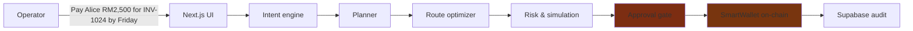

# PayMaster — System Architecture

> **Intent-Based Agentic Payment Router (PayMaster)**
> *Turn business payment instructions into optimized, explainable blockchain transactions.*

This document is the accurate, phase-final architecture of the PayMaster monorepo.
It supersedes earlier stubs (which incorrectly referenced `shadcn/ui` — the UI is
a hand-rolled dark-glass design system on TailwindCSS).

## 1. High-level flow



**Trust boundary:** the LLM interprets language and proposes strategy families
**only**. Every financial figure, route selection and risk score is computed by
deterministic code. A human always signs before the SmartWallet executes.
See [`AI_QUALITY_REVIEW.md`](./AI_QUALITY_REVIEW.md).

## 2. Repository layout (npm workspaces monorepo)

| Package | Path | Role |
|---|---|---|
| `shared` | `shared/` | Cross-package TypeScript types (`types/`) |
| `frontend` | `frontend/` | Next.js 14 (App Router) product UI + API routes + all engines |
| `backend` | `backend/` | Express + TypeScript API + health/status (thin layer) |
| `contracts` | `contracts/` | Solidity + Hardhat: `SmartWallet.sol`, `IntentRouter.sol`, mocks |
| `supabase` | `supabase/` | SQL schema + migrations + seed |

## 3. Frontend — where the product actually lives

- **App router pages:** `/` (home), `/operations` (AI payment operations),
  `/dashboard` (business payment operations dashboard), `/demo` (product demo).
- **API routes (`src/app/api/`):** `chat`, `chat/plan`, `chat/execute`,
  `business`, `dashboard`, `execution`, `intent/parse`, `planner`, `route/optim`,
  `risk/simulate`. Engine routes validate with **Zod** and return typed errors;
  persistence routes degrade gracefully to seeded fallbacks when Supabase is
  unconfigured (`isSupabaseConfigured()`).
- **Components (`src/components/`):** `chat/`, `payment/`, `planner/`, `risk/`,
  `execution/`, `wallet/`, `dashboard/`, `demo/`, plus `ui/` (reusable
  banner/empty/skeleton/badge/spinner/panel primitives added in Phase 12).
- **`comps/`, `src/hooks/`, `lib/`** are re-export shims pointing at the
  canonical implementations in `src/components`, `hooks/`, `src/lib`.
- **Engines (`src/lib/`)** — the deterministic core:
  - `payment/` — Phase 4 intent parser, plan generator, vendor directory, agent narration
  - `ai/` — Phase 5 LLM intent extraction (Structured Outputs + Zod + deterministic gate)
  - `planner/` — Phase 6 candidate execution plans
  - `route/` — Phase 7 deterministic route optimizer (weighted scoring)
  - `risk/` — Phase 8 risk checks, scoring, simulation, explanation, approval gate
  - `execution/` — Phase 10 validated SmartWallet execution + typed error mapping
  - `dashboard/` — Phase 11 aggregation + deterministic analytics
  - `demo/` — Phase 12 product demo pipeline (drives the real engines)

## 4. Data model (Supabase)

- **Businesses, wallets** — treasury profile + associated wallet addresses.
- **Payment requests, intents** — parsed structured operations.
- **Payment plans, route options, payment steps, risk assessments** — planning output.
- **Txns** — on-chain lifecycle `SUBMITTED → PENDING → CONFIRMED | FAILED`.
- **Approvals** — human approval records incl. risk level + signer.
- **Conversation messages** — chat history with intent/plan JSONB.
- **Audit logs** — event log for intent / plan / route / risk / approval / execution.

Migrations: `supabase/migrations/*.sql`; seed: `supabase/seed.sql`.

## 5. SmartWallet contract (`contracts/contracts/SmartWallet.sol`)

- Owner + authorized executors; incrementing nonce (replay protection);
  reentrancy guard; safe ERC-20 `_callOptionalReturn`; revert bubbling.
- Core: `executeTransaction`, `batchExecute`, `approveToken`, `transferToken`.
- Deployed locally to Hardhat 31337 (see `frontend/src/lib/execution/abi.ts`
  deployment registry — must mirror `contracts/deployments/localhost.json`).
- The contract never trusts the LLM: only explicit validated parameters from an
  authorized caller (the wallet owner after human approval).

## 6. Design system

- Dark glassmorphism on TailwindCSS: `glass-panel`, `glass-card`, `glass-input`,
  `glass-navbar`; brand indigo `#6366f1` / accent violet `#8b5cf6` / cyan `#06b6d4` /
  emerald `#10b981`; semantic success/danger/warning/info palettes (Phase 12).
- Custom animations: `step-pop`, `exec-pulse`, `flow-dash`, `shimmer`,
  `fade-in`, `slide-up`; `prefers-reduced-motion` respected.
- Phase 12 UI primitives in `src/components/ui/`: `Banner` (error/success/
  warning/info/neutral), `EmptyState`, `Skeleton*`, `Badge`, `Spinner`, `Panel`.

## 7. Offline / demo resilience

No `.env.local` is committed. When Supabase env vars are absent or unreachable,
the app never 500s: `/api/business` and `/api/dashboard` return seeded fallback
payloads (`isFallback: true`), `/api/chat` returns empty history, and the
ChatWindow runs a client-side deterministic parser/planner with an
"offline demo mode" banner. Treasury valuations come from seeded balances with
prices from `ASSET_PRICES` and are clearly labelled "Read-Only Demo Mode".

## 8. Build / run

```bash
npm install            # hoisted workspaces
npm run build          # shared -> backend -> frontend -> contracts
cd frontend && npx next dev --port 3000
```

Verification:

```bash
cd frontend && npx tsc --noEmit
cd frontend && npx tsx scripts/intent-selftest.ts   # + planner/route/risk/execution/dashboard/demo
cd contracts && npm run test:wallet                 # 23 SmartWallet tests
```

> Note: `next lint` will prompt to bootstrap ESLint (not configured) — the
> source of truth for correctness is `tsc --noEmit` plus the self-tests.