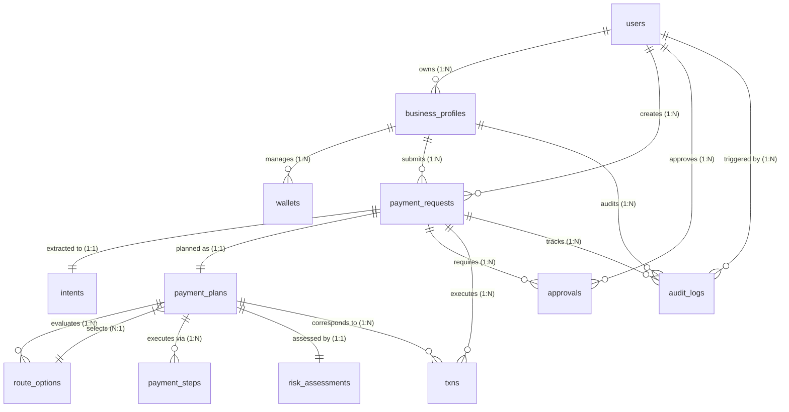

# PayMaster Database Entity Relationship & Lifecycle Architecture

## 1. Overview
The PayMaster (Intent-Based Payment) database is structured using **Supabase PostgreSQL** to support deterministic, auditable payment operations for business enterprises.

The entity relationships explicitly reflect the 8-stage payment lifecycle:
**Payment Request → AI Intent → Payment Plan → Route Options → Risk Assessment → Approval → Execution (Txns) → Audit Logs**

> **Trust boundary:** the AI only interprets the payment *intent*. Route selection is done by a deterministic weighted optimizer, and execution always requires human approval before any transaction is signed.

---

## 2. Entity Relationship Diagram (ERD)

---

## 3. Detailed Entity Reference

### 1. `users`
- **Purpose**: Synchronized profile table mirroring `auth.users`.
- **Primary Key**: `id` (UUID, references `auth.users.id` with `ON DELETE CASCADE`).
- **Key Columns**: `wallet_address` (UNIQUE), `display_name`, timestamps.
- **RLS**: Users can view and update only their own profile (`auth.uid() = id`).

### 2. `business_profiles`
- **Purpose**: Multi-tenant business profiles owned by an authenticated user.
- **Primary Key**: `id` (UUID).
- **Foreign Keys**: `owner_user_id` -> `users.id` (`ON DELETE CASCADE`).
- **RLS**: Restricted to business owner (`owner_user_id = auth.uid()`).

### 3. `wallets`
- **Purpose**: Treasury and operational blockchain wallets owned by business entity.
- **Primary Key**: `id` (UUID).
- **Foreign Keys**: `business_id` -> `business_profiles.id` (`ON DELETE CASCADE`).
- **RLS**: Accessible only to business owner via `public.is_business_owner(business_id)`.

### 4. `payment_requests`
- **Purpose**: High-level payment intent submitted via Chat, Dashboard, or API Integration.
- **Primary Key**: `id` (UUID).
- **Foreign Keys**: `business_id` -> `business_profiles.id`, `created_by` -> `users.id`.
- **Status Enum**: `DRAFT`, `PLANNING`, `PENDING_APPROVAL`, `APPROVED`, `EXECUTING`, `COMPLETED`, `FAILED`, `CANCELLED`.
- **Source Enum**: `DASHBOARD`, `CHAT`, `INTEGRATION`.
- **RLS**: Restricted to business owner.

### 5. `intents`
- **Purpose**: Structured output from AI LLM Intent Engine.
- **Primary Key**: `id` (UUID).
- **Foreign Keys**: `payment_request_id` -> `payment_requests.id` (`ON DELETE CASCADE`).
- **Attributes**: `action`, `recipient`, `amount`, `currency`, `target_chain`, `confidence` (0.0–1.0), `missing_information` (JSONB), `raw_input`.
- **RLS**: Restricted to business owner via `public.is_payment_request_owner(payment_request_id)`.

### 6. `payment_plans`
- **Purpose**: Optimized multi-step plan compiled by the PayMaster Payment Router.
- **Primary Key**: `id` (UUID).
- **Foreign Keys**: `payment_request_id` -> `payment_requests.id`, `selected_route_id` -> `route_options.id` (`ON DELETE SET NULL`, Deferrable).
- **Attributes**: `total_estimated_gas`, `estimated_duration` (sec), `savings`, `explanation`, `risk_score` (0–100).
- **RLS**: Restricted to business owner.

### 7. `route_options`
- **Purpose**: Multiple evaluated cross-chain routing paths generated by optimization engine.
- **Primary Key**: `id` (UUID).
- **Foreign Keys**: `payment_plan_id` -> `payment_plans.id` (`ON DELETE CASCADE`).
- **Attributes**: `route_name`, `chain`, `estimated_gas`, `estimated_time`, `transaction_count`, `risk_score`, `total_score`, `savings`, `is_recommended` (BOOLEAN).
- **RLS**: Restricted to business owner via `public.is_payment_plan_owner(payment_plan_id)`.

### 8. `payment_steps`
- **Purpose**: Atomic execution steps composing a payment route.
- **Primary Key**: `id` (UUID).
- **Foreign Keys**: `payment_plan_id` -> `payment_plans.id` (`ON DELETE CASCADE`).
- **Attributes**: `step_order`, `action_type`, `title`, `description`, `source_chain`, `destination_chain`, `tok` (token symbol), `estimated_gas`, `estimated_duration`, `status` (`PENDING`, `EXECUTING`, `COMPLETED`, `FAILED`, `SKIPPED`).
- **RLS**: Restricted to business owner.

### 9. `risk_assessments`
- **Purpose**: Security & risk check matrix before payment approval/execution.
- **Primary Key**: `id` (UUID).
- **Foreign Keys**: `payment_plan_id` -> `payment_plans.id` (`ON DELETE CASCADE`).
- **Checks**: `balance_check`, `recipient_check`, `slippage_check`, `network_check`, `contract_check` (`PASS`/`WARN`/`FAIL`).
- **Overall Risk**: `LOW`, `MEDIUM`, `HIGH`, `CRITICAL`.
- **Warnings**: `warnings` (JSONB array).
- **RLS**: Restricted to business owner.

### 10. `approvals`
- **Purpose**: Governance sign-off record before payment execution.
- **Primary Key**: `id` (UUID).
- **Foreign Keys**: `payment_request_id` -> `payment_requests.id`, `approved_by` -> `users.id`.
- **Status**: `PENDING`, `APPROVED`, `REJECTED`.
- **RLS**: Restricted to business owner.

### 11. `txns`
- **Purpose**: On-chain transaction ledger.
- **Primary Key**: `id` (UUID).
- **Foreign Keys**: `payment_request_id` -> `payment_requests.id`, `payment_plan_id` -> `payment_plans.id`.
- **Attributes**: `hash` (UNIQUE), `status` (`PENDING`, `CONFIRMED`, `FAILED`), `chain_id`, `gas_used`, `gas_cost`, `explorer_url`.
- **RLS**: Restricted to business owner.

### 12. `audit_logs`
- **Purpose**: Immutable security audit log tracking all approved payment operations.
- **Primary Key**: `id` (UUID).
- **Foreign Keys**: `business_id` -> `business_profiles.id`, `user_id` -> `users.id`, `payment_request_id` -> `payment_requests.id`.
- **Attributes**: `event_type`, `description`, `meta` (JSONB).
- **RLS**: Restricted to business owner.
